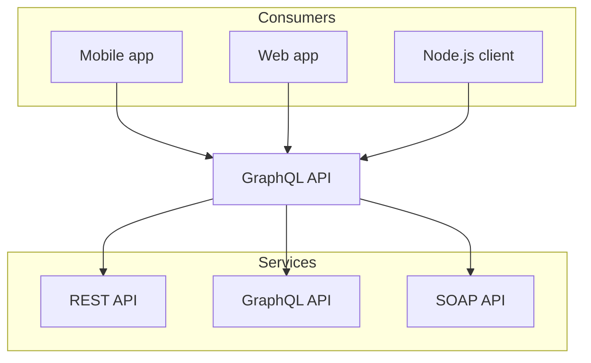
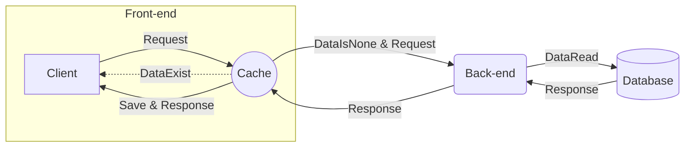
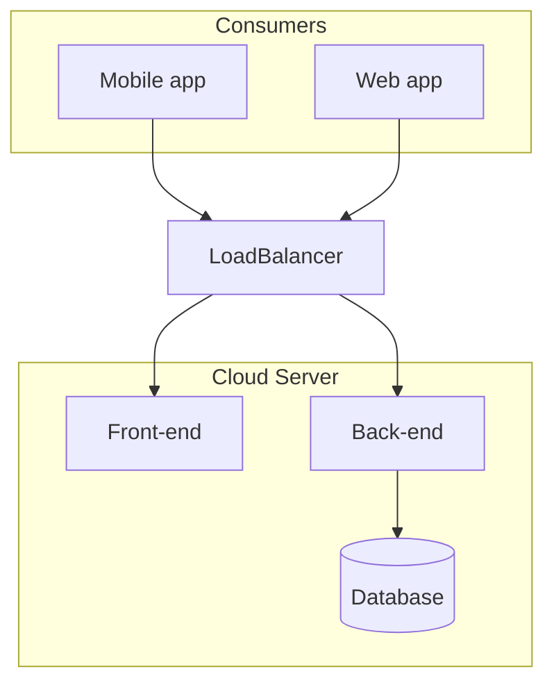
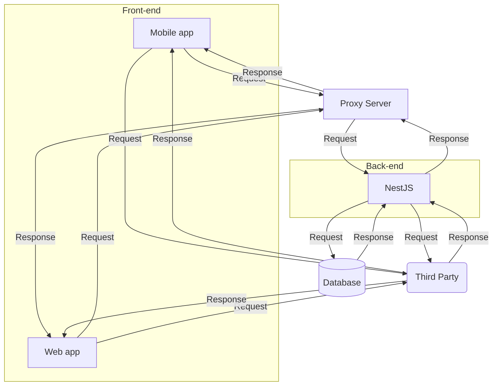

# Mermaid

Nextra는 Mermaid 다이어그램을 지원한다.  
GitHub에서처럼 Mermaid 코드 블록 언어를 사용하여 마크다운 파일에서 사용할 수 있다.  
Nextra는 코드 블록을 \<Mermaid /> 구성 요소로 대체하는 @guild/remark-mermaid 패키지를 사용한다.

## Mermaid 사용법

예제:

```js
graph TD;
subgraph AA [Consumers]
A[Mobile app];
B[Web app];
C[Node.js client];
end
subgraph BB [Services]
E[REST API];
F[GraphQL API];
G[SOAP API];
end
Z[GraphQL API];
A --> Z;
B --> Z;
C --> Z;
Z --> E;
Z --> F;
Z --> G;
```

결과:



<br />

## Mermaid 예제 1



<br />

## Mermaid 예제 2



<br />

## Mermaid 예제 3


